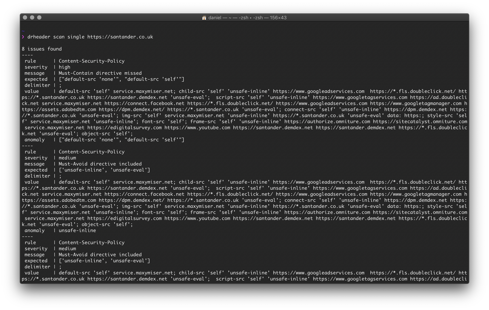
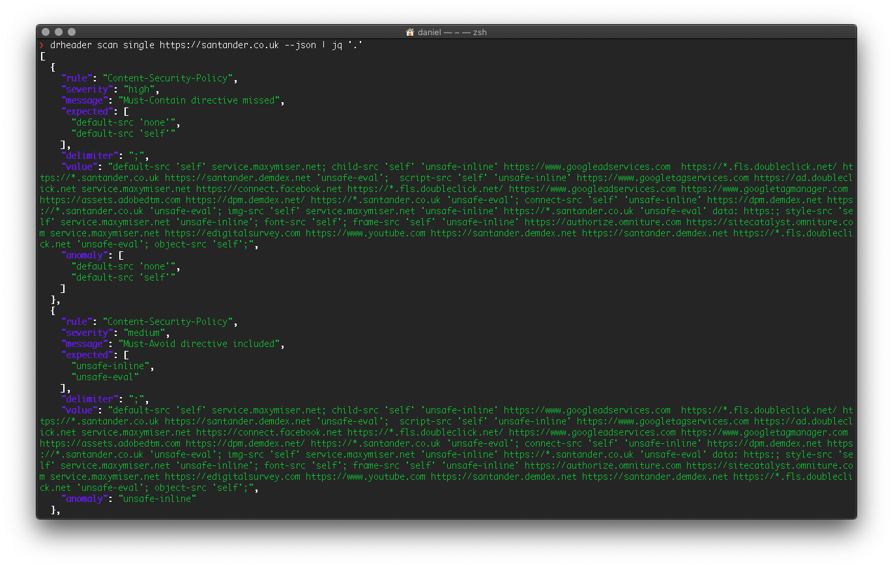

[](https://GitHub.com/Santandersecurityresearch/DrHeader/releases/)
[](https://GitHub.com/Santandersecurityresearch/DrHeader/releases/)
[](http://hits.dwyl.io/Santandersecurityresearch/DrHeader)
[](https://lgtm.com/projects/g/Santandersecurityresearch/DrHeader/alerts/)
[](https://lgtm.com/projects/g/Santandersecurityresearch/DrHeader/context:python)
[](http://opensource.org/licenses/MIT)


# Welcome to drHEADer

There are a number of HTTP headers which enhance the security of a website when used. Often ignored, or unknown, these HTTP security headers help prevent common web application vulnerabilities when used.

DrHEADer helps with the audit of security headers received in response to a single request or a list of requests.

When combined with the OWASP [Application Security Verification Standard](https://github.com/OWASP/ASVS/blob/master/4.0/en/0x22-V14-Config.md) (ASVS) 4.0, it is a useful tool to include as part of an automated CI/CD pipeline which checks for missing HTTP headers.

## How Do I Install It?

This project was developed with Python 3.7.4.
Whilst it works with Python 2.x, End of Life (EOL) is coming so if possible, use 3.x. The easiest way to install drHEADer is to clone this repository and via a terminal window, run the following command:

```sh
$ python3 setup.py install --user
```

This will install all the pre-requisites and you'll end up with a drheader executable.

## How Do I Use It?

There are two ways you could use drHEADer, depending on what you want to achieve. The easiest way is using the CLI.

### CLI

drHEADer can perform a single scan against a target and report back which headers are present, like so:

``` console
$ drheader scan single https://santander.co.uk
```


If you wish to scan multiple sites, you'll need the targets in a JSON format, or a txt file, like so:

```json
  [
    {
      "url": "https://example.com",
      "params": {
          "example_parameter_key": "example_parameter_value"
      }
    },
    ...
  ]
```

For txt files, use the following command:

```sh
$ drheader scan bulk -ff targets.txt
```

There are a number of parameters you can specify during bulk scans, these are:
| Option            | Description                                            |
| :---------------- | :----------------------------------------------------- |
| -p, --post        | Use a post request to obtain headers                   |
| --json            | Output report as json                                  |
| --debug           | Show error messages                                    |
| --rules FILENAME  | Use custom rule set                                    |
| --rules-uri URL   | Use custom rule set, to download from a remote server  |
| --merge           | Merge custom rule set on top of default set            |
| --help            | Show this message and exit                             |
| --junit           | Creates a junit report in `./reports/junit.xml` folder |

To save scan results, you can use the --json parameter and pipe it to [jq](https://stedolan.github.io/jq/), which is a lightweight and flexible command-line JSON processor,like so:

```sh
$ drheader scan single https://santander.co.uk --json | jq '.'
```



### In a Project

It is also possible to call drHEADer from within an existing project, and this is achieved like so:

```python
from drheader import Drheader

# create drheader instance
drheader_instance = Drheader(headers={'X-XSS-Protection': '1; mode=block'}, status_code=200)

report = drheader_instance.analyze()
print(report)
```

#### Customize HTTP method and headers

By default, the tool uses **GET** method when making a request, but you can change that by supplying the `method` argument like this:

```python
# create drheader instance
drheader_instance = Drheader(url="http://test.com", method="POST")
```

Remember you can use any method supported by `requests` such as POST, PUT, GET and DELETE.

At the same time, you can customize the headers sent by the request. For that, you just have to use the `request_headers` argument:

```python
# create drheader instance
custom_headers = {"token": "1234aerhga"}
drheader_instance = Drheader(url="http://test.com", request_headers=custom_headers)
```

As we continue development on drHEADer, we will further enhance this functionality.

##### Other `requests` arguments

The _verify_ argument supported by `requests` can be included. The default value is set to `True`.

```python
# create drheader instance
drheader_instance = Drheader(url="http://test.com", verify=False)
```

Other arguments may be included in the future such as _timeout_, *allow_redirects* or _proxies_.

## How Do I Customise drHEADer Rules?

DrHEADer relies on a yaml file that defines the policy it will use when auditing security headers. The file is located at `./drheader/rules.yml`, and you can customise it to fit your particular needs. Please follow this [link](RULES.md) if you want to know more.

## Notes

* On ubuntu systems you may need to install libyaml-dev to avoid errors related to a missing yaml.h.

### Roadmap

We have a lot of ideas for drHEADer, and will push often as a result. Some of the things you'll see shortly are:

* Building on the Python library to make it easier to embed in your own projects.
* Releasing the API, which is seperate from the core library - the API allows you to hit URLs or endpoints at scale
* Better integration into MiTM proxies.

## Who Is Behind It?

DrHEADer was developed by the Santander UK Security Engineering team, who are:

* David Albone
* [Javier Domínguez Ruiz](https://github.com/javixeneize)
* Fernando Cabrerizo
* [James Morris](https://github.com/actuallyjamez)
